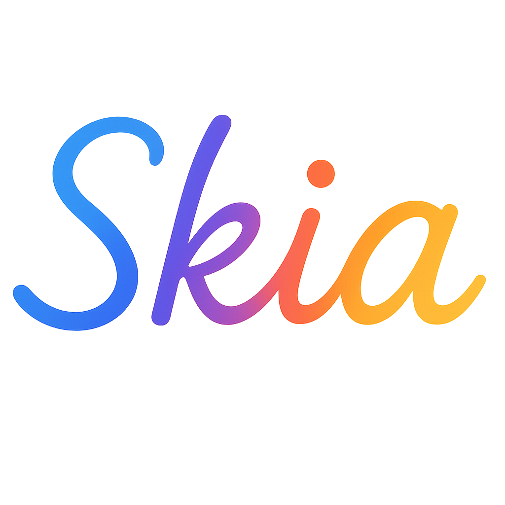

<div align="center">

# React Skia

[](https://www.typescriptlang.org/)
[](./LICENSE)
[](https://github.com/kimjaedeok/react-skia)

**High-performance 2D graphics for the web using React and Skia**



</div>

React Skia brings the power of [Skia Graphics Library](https://skia.org) to React applications running in browsers. Built on top of Google's CanvasKit-WASM, it provides a React-friendly API for creating complex 2D graphics with hardware acceleration.

> **⚠️ Development Status**: This project is currently in active development and not yet published to npm. Please clone and build from source.

## ✨ Features

- 🚀 **Hardware Accelerated** - GPU-powered rendering via CanvasKit-WASM
- 🎨 **Basic Graphics API** - Rectangle, Circle, Path, Text rendering
- 💪 **TypeScript First** - Full type safety and IntelliSense support
- 🌐 **Web Optimized** - Built for modern browsers with WebAssembly
- 🎮 **React Integration** - Familiar component-based API

## 🚀 Getting Started

### Development Setup

Clone and run the project locally:

```bash
# Clone the repository
git clone https://github.com/your-username/react-skia.git
cd react-skia

# Install dependencies
pnpm install

# Start the development playground
pnpm dev
```

Visit `http://localhost:5173` to explore the interactive playground with live demos.

### Using the Library (Development)

Once you've cloned and built the project, you can use it in your applications:

```tsx
import { Canvas, Circle, LinearGradient, Rect, Text } from "react-skia";

function App() {
  return (
    <Canvas width={400} height={300}>
      {/* Basic shapes */}
      <Rect x={10} y={10} width={100} height={80} color="#FF6B6B" />
      <Circle cx={200} cy={50} r={30} color="#4ECDC4" />

      {/* Text rendering */}
      <Text x={10} y={150} text="Hello Skia Web!" fontSize={20} color="#333" />

      {/* Gradient effects */}
      <Rect x={250} y={80} width={120} height={60}>
        <LinearGradient
          start={{ x: 0, y: 0 }}
          end={{ x: 120, y: 0 }}
          colors={["#667eea", "#764ba2"]}
        />
      </Rect>
    </Canvas>
  );
}
```

## 📚 Documentation

Explore our documentation and examples:

- **[Live Playground](./apps/playground)** - Interactive demos and examples
- **[API Reference](./packages/react-skia/src/types.ts)** - TypeScript interfaces and type definitions
- **[Source Code](./packages/react-skia/src)** - Core library implementation

## 🎮 Interactive Examples

The playground includes these demos:

- 🔸 **Basic Shapes** - Rectangles, circles, and stroke styles
- 📝 **Text Rendering** - Basic text with font size and color controls
- 🎨 **Path Drawing** - SVG-compatible path rendering
- 🌈 **Gradient Effects** - Linear and radial gradients
- 👥 **Groups & Opacity** - Layering and transparency controls
- 🖼️ **Image Rendering** - Basic image loading and display
- 🏞️ **Complex Scenes** - Simple graphics compositions
- 🚀 **Performance Tests** - Static rendering test with 100 shapes

## 🛠️ Development

### Project Structure

```
react-skia/
├── packages/
│   └── react-skia/          # Core library
│       ├── src/
│       │   ├── components/  # React components (Canvas, Rect, etc.)
│       │   ├── renderer/    # Skia rendering engine
│       │   ├── hooks/       # React hooks
│       │   └── types.ts     # TypeScript definitions
│       └── package.json
└── apps/
    └── playground/          # Interactive demo application
        └── src/
            └── components/
                └── demos/   # Example implementations
```

### Building from Source

```bash
# Install dependencies
pnpm install

# Build the library
pnpm build

# Run development server
pnpm dev

# Type checking
pnpm check-types

# Linting
pnpm lint
```

### Package Scripts

- `pnpm dev` - Start development server with hot reload
- `pnpm build` - Build production bundle
- `pnpm lint` - Run ESLint
- `pnpm check-types` - TypeScript type checking
- `pnpm format` - Format code with Prettier

## 🎨 API Reference

### Core Components

#### Canvas

The root container for all Skia graphics:

```tsx
<Canvas width={400} height={300}>
  {/* Your graphics components */}
</Canvas>
```

#### Basic Shapes

```tsx
// Rectangle
<Rect x={10} y={10} width={100} height={50} color="#FF6B6B" />

// Circle
<Circle cx={100} cy={100} r={50} color="#4ECDC4" />

// Text
<Text x={10} y={100} text="Hello World" fontSize={20} color="#333" />
```

#### Advanced Graphics

```tsx
// SVG Paths
<Path
  path="M 10 80 Q 95 10 180 80"
  color="#F39C12"
  strokeWidth={4}
  style="stroke"
/>

// Groups with opacity
<Group opacity={0.8}>
  <Rect x={0} y={0} width={100} height={100} color="#E67E22" />
</Group>

// Gradients
<Rect x={10} y={10} width={200} height={100}>
  <LinearGradient
    start={{ x: 0, y: 0 }}
    end={{ x: 200, y: 0 }}
    colors={["#667eea", "#764ba2"]}
  />
</Rect>
```

## 🚀 Performance

React Skia is built for performance:

- **Hardware Acceleration**: Leverages GPU through CanvasKit-WASM
- **Efficient Rendering**: Direct canvas manipulation with minimal React overhead
- **Memory Management**: Automatic cleanup of Skia objects
- **Optimized for Modern Browsers**: Built on proven CanvasKit-WASM technology

### Performance Characteristics

React Skia provides:

- 🎯 **GPU Acceleration** - Hardware-accelerated rendering via WebGL
- 🔄 **Efficient Updates** - Smart component diffing and batching
- 📦 **Tree Shakeable** - Import only what you need
- 🧹 **Memory Safe** - Automatic resource cleanup

> **Note**: Comprehensive performance benchmarks are planned for future releases. Current implementation includes a basic stress test with 100+ static shapes in the playground.

## 🤝 Contributing

We welcome contributions! This project is in active development.

### Development Setup

1. Fork the repository
2. Clone your fork: `git clone https://github.com/your-username/react-skia.git`
3. Install dependencies: `pnpm install`
4. Create a feature branch: `git checkout -b feature/amazing-feature`
5. Make your changes and add tests
6. Build the project: `pnpm build`
7. Test your changes: `pnpm dev` (run playground)
8. Commit your changes: `git commit -m 'feat: add amazing feature'`
9. Push to your fork: `git push origin feature/amazing-feature`
10. Open a Pull Request

### Code Style

This project follows strict coding standards:

- **ESLint**: Google Style Guide compliance
- **Prettier**: Consistent code formatting
- **TypeScript**: Strict type checking
- **Conventional Commits**: Standardized commit messages

## 📋 Roadmap

### Current Status ✅

- ✅ Basic shapes (Rect, Circle, Path)
- ✅ Basic text rendering
- ✅ SVG-compatible path drawing
- ✅ Linear and radial gradients
- ✅ Groups and opacity control
- ✅ Basic image rendering with fit modes
- ✅ Blur and color matrix filters
- ✅ TypeScript support
- ✅ React 19 compatibility

### In Progress 🚧

- 🚧 Animation system (useSharedValue)
- 🚧 Touch/mouse event handling
- 🚧 Clipping and masking
- 🚧 Gesture recognition
- 🚧 Advanced transforms

### Planned 📋

- 📋 NPM package publication
- 📋 Animation system (useSharedValue)
- 📋 Touch/mouse event handling
- 📋 Advanced font and text features
- 📋 Performance optimizations
- 📋 Clipping and masking
- 📋 Advanced transforms
- 📋 Performance profiling tools

## 📊 Browser Support

React Skia requires WebAssembly support and works on these modern browsers:

- ✅ **Chrome 57+** (March 2017)
- ✅ **Firefox 52+** (March 2017)
- ✅ **Safari 11+** (September 2017)
- ✅ **Edge 16+** (October 2017)

> **Note**: WebAssembly is required for CanvasKit-WASM functionality. Older browsers without WebAssembly support are not compatible.

## 🙏 Acknowledgments

- **[Google Skia Team](https://skia.org)** - For the powerful Skia graphics library
- **[CanvasKit](https://github.com/google/skia/tree/main/modules/canvaskit)** - For the WebAssembly port of Skia
- **[Shopify's React Native Skia](https://github.com/Shopify/react-native-skia)** - For the API design inspiration

---

<div align="center">

**[🚀 Get Started](#quick-start)** • **[📚 Documentation](#documentation)** • **[🎮 Examples](#interactive-examples)** • **[🤝 Contributing](#contributing)**

Made with ❤️ by kim-jaedeok

</div>
